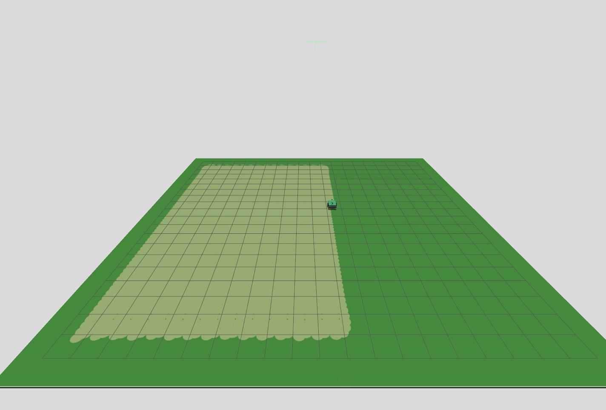

# Robotic Lawn Mower — Version 3

A ROS 2 + Gazebo simulation of a differential-drive robotic lawn mower: a chassis on two driven wheels and a rear caster, with a spinning cutting blade mounted under a mower deck, wheel odometry and simulated GPS/IMU fused through a dual EKF into a persistent `map` frame, a lidar for perception, a Nav2 stack for autonomous navigation and obstacle avoidance, and a GPS-anchored coverage planner that mows the entire lawn boundary autonomously. Driving it over the lawn with the blade spinning paints a "mowed" trail on the ground.

The default setup mows a 20 × 20 m boundary on a 22 × 22 m field — the field is deliberately larger than the mow area so an imperfect stop at a boundary corner lands on solid ground instead of driving off the edge.



## What's new in this version

Version 2 got local autonomy working — the robot could localize and navigate, but only within its own `odom` frame, with no persistent notion of where it was on the actual lawn. Version 3 adds that persistent global frame and uses it to mow the whole field, not just react locally:

| | Version 2 | Version 3 |
|---|---|---|
| Localization | Single EKF, `odom` frame only — drifts with no absolute reference | Dual EKF + `navsat_transform_node`: a local EKF (`odom` frame, as before) and a global EKF (`map` frame) fusing simulated GPS + IMU heading, giving a non-drifting `map → odom` transform |
| Sensors | Lidar only | Lidar + simulated GPS (NavSat) + IMU |
| Navigation | Nav2's `bt_navigator`/`behavior_server`/global costmap all confined to `odom` — no persistent frame to navigate against | Nav2 re-pointed at `map`: a field-sized, non-rolling global costmap, plus the same lidar-based local costmap/obstacle avoidance as before |
| Coverage planning | Not implemented | A GPS-surveyed boundary polygon (`boundary.yaml`) drives a boustrophedon (back-and-forth) coverage planner, executed as one continuous path via Nav2's `FollowPath` |

- **GPS + IMU simulation added.** A simulated NavSat sensor (`/gps/fix`) and IMU (`/imu`) give the robot an absolute position and heading reference, anchored to a real-world lat/lon origin (`spherical_coordinates` in `lawn_field.sdf`).
- **Global localization added.** `navsat_transform_node` converts GPS fixes into the `map` frame, fused by a second `robot_localization` EKF alongside the existing local one — `odometry/filtered/local` and `odometry/filtered/global` are now both published. Gazebo's DiffDrive plugin still emits its own odometry/TF on the Gazebo side, but it is deliberately left out of `gazebo_bridge.yaml`, so it never reaches ROS and cannot compete with the EKFs' transforms.
- **Nav2 now operates in `map`.** The global costmap is sized to the field instead of rolling with the robot, so it can hold the mow boundary as a persistent reference; local costmap/controller behavior is unchanged.
- **Coverage path planning added.** `boundary_loader.py` publishes a GPS-derived mow boundary, `coverage_planner.py` insets it by a safety margin and sweeps it into a serpentine path at the mower's cutting width (with configurable overlap), resampled to planner resolution, and `coverage_executor.py` drives from wherever the robot is to the path start and then through the whole sweep as a single `FollowPath` goal.

Camera-based obstacle detection/classification and obstacle-aware replanning during a coverage run are the next milestones; see the [Project guide](#project-guide).

## Packages

- **`mower3_description`** — the robot model.
  - `urdf/robot_base.xacro` — chassis, wheels, caster, deck, blade, bumper, lidar/IMU/GPS mounts (links, joints, inertials).
  - `urdf/common_properties.xacro` — shared materials and inertia macros.
  - `urdf/robot_base_gazebo.xacro` — Gazebo plugins: differential drive, blade joint control, joint state publishing, caster friction, and the lidar (`gpu_lidar`, 5 Hz), IMU (50 Hz), and NavSat (GPS, 5 Hz) sensors.
  - `urdf/robot.urdf.xacro` — top-level file that combines the above into the full robot description.
  - `launch/display.launch.xml` — view the robot in RViz only (no simulation).
  - `rviz/urdf_config.rviz` — RViz display configuration.

- **`mower3_bringup`** — simulation, localization, and navigation bring-up.
  - `worlds/lawn_field.sdf` — a 22 × 22 m grass field, anchored to a real-world lat/lon origin (`spherical_coordinates`, default 45.0 N / 9.0 E) for GPS simulation, with the default Gazebo GUI layout and a video-recorder toolbar button. Loads three sensor system plugins: `Sensors` (rendering sensors — lidar), `Imu`, and `NavSat`. All three are required; `Sensors` alone drives only the lidar, and without the other two the IMU and GPS advertise their topics but never publish.
  - `launch/mower.launch.xml` — launches Gazebo, spawns the robot, and starts `robot_state_publisher`, the ROS↔Gazebo bridge, the grass-cutting trail node, wheel odometry, the local + global EKFs, `navsat_transform_node`, and RViz.
  - `launch/navigation.launch.xml` — starts the Nav2 stack (controller, planner, behavior server, BT navigator, lifecycle manager), operating in the `map` frame.
  - `launch/coverage.launch.xml` — starts the coverage-planning pipeline: `mower3_coverage`'s boundary loader, coverage planner, and coverage executor nodes.
  - `config/gazebo_bridge.yaml` — topic bridge between ROS 2 and Gazebo: clock, `/cmd_vel`, `/joint_states`, `/scan` (lidar), `/imu`, `/gps/fix`, blade command, and ground-truth pose (used to validate odometry drift, not as a navigation input).
  - `config/ekf_local.yaml` — local `robot_localization` EKF (`odom` frame), fusing wheel odometry and IMU yaw.
  - `config/ekf_global.yaml` — global `robot_localization` EKF (`map` frame), additionally fusing GPS-derived odometry.
  - `config/navsat_transform.yaml` — `navsat_transform_node` parameters, including the fixed datum shared with `boundary.yaml` and the world SDF.
  - `config/boundary.yaml` — the 20 × 20 m mow boundary as GPS lat/lon corners around that same datum.
  - `config/nav2_params.yaml` — Nav2 controller/planner/costmap parameters. The global costmap is non-rolling and field-sized (30 × 30 m at origin −15, −15) so it contains the whole boundary plus margin.
  - `scripts/wheel_odometry.py` — computes odometry from wheel joint states and publishes `/odom`. Integrates on every `/joint_states` sample but publishes at a capped `publish_rate` (default 50 Hz), with the twist averaged over the publish window — `/joint_states` arrives in the hundreds of Hz, which is both wasteful and noisy for the EKF.
  - `scripts/grass_mower.py` — paints a mowed trail behind the deck while the blade is spinning, using the robot's ground-truth simulated pose (not odometry, which drifts). Paints one `patch_radius` (0.24 m) disc every `trail_spacing` (0.25 m) of travel, accumulated and spawned `batch_size` at a time (default 25) as a single Gazebo model holding many visuals, via a non-blocking subprocess. Both the batching and the spacing exist to bound rendering cost — see [Troubleshooting](#troubleshooting) on the trail slowing the simulation down.

- **`mower3_coverage`** — GPS-anchored coverage path planning and execution, launched by `mower3_bringup`'s `coverage.launch.xml`.
  - `boundary_loader.py` — converts `mower3_bringup`'s `config/boundary.yaml` lat/lon corners into a `map`-frame polygon (`/mow_boundary`).
  - `coverage_planner.py` — insets the boundary by `boundary_inset`, sweeps it into a serpentine coverage path, and resamples it at `point_spacing` before publishing `/coverage_path`.
  - `coverage_executor.py` — asks the global planner for an approach path to the coverage start, concatenates it with the sweep, and drives the whole thing as one `FollowPath` goal.
  - `coverage_checker.py` — (diagnostic) reconstructs the mowed area from ground truth and reports what percentage of the boundary was actually cut, publishing uncovered gaps to `/coverage_gaps` for RViz.
  - `path_tracking_monitor.py` — (diagnostic) compares the planned path, the EKF pose Nav2 steers by, and Gazebo ground truth, to tell controller-tracking problems apart from localization problems.

## Prerequisites

- ROS 2 Jazzy
- Gazebo Harmonic (`gz-sim8`) and `ros_gz`
- `robot_localization` and `Navigation2`, if not already installed:
  ```
  sudo apt install ros-jazzy-robot-localization ros-jazzy-navigation2 ros-jazzy-nav2-bringup
  ```
- `shapely` and `pymap3d`, used by the coverage-planning scripts. Install them for the **system** Python that ROS uses, not a virtualenv:
  ```
  sudo apt install python3-shapely
  pip install --break-system-packages pymap3d
  ```
- (optional, for manual driving) `teleop_twist_keyboard`

> **Do not run any of this with a conda environment active.** ROS 2 Jazzy's `rclpy` ships a C extension built for the system CPython (3.12); conda's interpreter is a different version, so every node dies with `No module named 'rclpy._rclpy_pybind11'`. Run `conda deactivate` before sourcing ROS. If conda auto-activates in new shells, `conda config --set auto_activate_base false`.

## Build

```
colcon build
source install/setup.bash
```

## Running the simulation

**Terminal 1 — launch the robot in Gazebo + RViz** (also starts odometry, GPS/IMU simulation, and local + global localization):
```
ros2 launch mower3_bringup mower.launch.xml
```
**Terminal 2 — spin up the blade** (send `0.0` to stop it):
```
ros2 topic pub --once /blade_cmd_vel std_msgs/msg/Float64 "{data: 30.0}"
```

Drive around with the blade spinning and a lighter-green mowed trail will appear behind the mower deck, matching the robot's actual path.

## Running autonomous navigation

**Terminal 2 — start the Nav2 stack** (now operating in the `map` frame):
```
ros2 launch mower3_bringup navigation.launch.xml
```

## Running full-lawn coverage

With the simulation and Nav2 already running (Terminals 1–2 above):

**Terminal 3 — start the coverage pipeline:**
```
ros2 launch mower3_bringup coverage.launch.xml
```
This loads `config/boundary.yaml` (the mow area boundary in GPS coordinates), insets it, sweeps it into a serpentine coverage path at the mower's cutting width, and drives it end-to-end via Nav2's `FollowPath` action. Watch `/coverage_path` in RViz, and the grass-mower trail should fill in the boundary as it completes.

Spin up the blade first (see above) if you want the trail to actually paint while it mows.

With the defaults (`cutting_width` 0.42, `overlap` 0.15) the row spacing is ~0.357 m, giving 53 rows across the 19 m inset area — about 1030 m of driving, or roughly an hour of sim time at `desired_linear_vel` 0.3 m/s.

### Coverage parameters

Set in `launch/coverage.launch.xml`:

| Parameter | Default | Purpose |
|---|---|---|
| `cutting_width` | 0.42 | Deck cutting width; with `overlap` sets row spacing |
| `overlap` | 0.15 | Fractional overlap between adjacent rows |
| `boundary_inset` | 0.5 | Shrinks the boundary before planning, so the robot's body stays inside the mow area |
| `point_spacing` | 0.2 | Resampling resolution of the published path |

`boundary_inset` trades coverage against margin. Rows are planned at least this far inside the boundary, which keeps the robot's body (footprint half-extents 0.35 m fore/aft, 0.25 m lateral) from overhanging it. But the painted swath only reaches `patch_radius` (0.24 m) either side of the path, so any inset larger than that leaves an uncut ring of `inset − 0.24` m around the perimeter — ~0.26 m at the default, cutting ~93% of the boundary rectangle. Reduce it to cut closer to the edge, at the cost of the mower overhanging the boundary on turns.

`point_spacing` is not cosmetic. Nav2's controller clips the path it follows to the local costmap window, so a path with only the two endpoints per row (19 m apart) leaves it with a lookahead point on top of the robot and no heading to pursue — it stops dead at the row start. Keep this at planner resolution.

## Verifying it works

Two diagnostic nodes are included. Run either alongside a coverage run and Ctrl-C to print a summary.

**Did it actually mow everything?**
```
ros2 run mower3_coverage coverage_checker.py
```
Reconstructs the mowed area from ground truth, intersects it with the boundary, and reports a coverage percentage plus a pass/fail against `coverage_threshold` (default 0.95). Uncovered gaps are published as outlines on `/coverage_gaps` — add it as a Marker Array in RViz to see exactly where it missed.

**Is it driving where it thinks it is?**
```
ros2 run mower3_coverage path_tracking_monitor.py
```
Reports cross-track error of both the EKF estimate and ground truth against the planned path, plus the gap between the two. A healthy run looks like this:

```
ground truth vs planned path: mean 0.014m  p95 0.064m  max 0.175m
EKF estimate vs planned path: mean 0.013m  p95 0.067m  max 0.175m
EKF estimate vs ground truth: mean 0.006m  p95 0.011m  max 0.013m
```

If the EKF hugs the path but ground truth does not, localization is lying to Nav2. If both agree yet stray from the path, it's controller tracking. The node prints which of the two it sees.

## Recording a video

The Gazebo window includes a record button in the toolbar (added via `worlds/lawn_field.sdf`) that saves an `.mp4` of the 3D view — click it to start, click again to stop and save.

## Viewing the robot model only (no simulation)

```
ros2 launch mower3_description display.launch.xml
```

## Troubleshooting

Failure modes that cost real debugging time here, and what they look like.

**Nodes die with `No module named 'rclpy._rclpy_pybind11'`** — a conda environment is active. See [Prerequisites](#prerequisites).

**The robot never moves, or Nav2 aborts with `FAILED_TO_MAKE_PROGRESS` (105) / `INVALID_PATH` (103)** — usually the path handed to `FollowPath`, not the controller. The path must be dense (see `point_spacing` above) and its start must be reachable from the robot's current pose. `INVALID_PATH` specifically means the controller found no path poses inside its local costmap, which also happens when the estimated pose is wildly wrong (see the datum note below).

**The GPS-fused pose jumps by ~10,000,000 m** — the datum is on the equator. UTM uses a 10,000 km false northing in the southern hemisphere, so a field straddling latitude 0 makes the northing jump by that amount every time the robot crosses it. Keep the datum at a mid-latitude, away from UTM zone boundaries (zones are 6° of longitude wide). The default 45.0 N / 9.0 E sits in the middle of zone 32N.

**The mowed trail wanders even though Nav2 logs look clean** — Nav2 is tracking its estimated pose perfectly while that pose drifts from reality. Check that each localization input is actually publishing (`ros2 topic hz` takes one topic at a time):
```
ros2 topic hz /gps/fix          # expect ~5 Hz
ros2 topic hz /imu              # expect ~50 Hz
ros2 topic hz /odometry/gps     # expect ~5 Hz
```
Silence here means the global EKF is dead-reckoning on wheel odometry alone, which drifts without bound. The usual cause is a missing `Imu`/`NavSat` system plugin in the world SDF — the sensors advertise their topics either way, so the topics exist but carry nothing. `path_tracking_monitor.py` diagnoses this directly.

**The datum must match in three places** — `worlds/lawn_field.sdf` (`spherical_coordinates`), `config/boundary.yaml` (`datum`), and `config/navsat_transform.yaml` (`datum`). If you move it, recompute the `boundary.yaml` corners for the new origin; the longitude-to-metres scaling changes with latitude.

**`libEGL ... failed to create dri2 screen` from Gazebo** — hardware-accelerated rendering is unavailable and Gazebo has fallen back to software rendering. The simulation still runs, but the real-time factor suffers and control quality degrades with it. This is environment/driver configuration, not a repo setting, and it is the single biggest lever on the slowdown below.

**The mower gets progressively slower the longer it mows** — the robot is not being commanded slower; the simulator's clock is falling behind. Check the real-time factor:
```
gz topic -e -t /world/lawn_world/stats -n 1 | grep real_time_factor
```
Three things compound here. The painted trail accumulates permanently, so its geometry grows linearly with distance mowed. The lidar is a `gpu_lidar`, which re-renders the whole scene once per scan, so that growing geometry is paid for repeatedly rather than once. And if EGL has fallen back to software rendering (above), all of it lands on the CPU with no GPU headroom to absorb it. An observed run decayed from ~1.0 to 0.63 over about 40 minutes of sim time.

Three knobs, in order of leverage: fix the EGL fallback; raise `trail_spacing` in `grass_mower.py` (bounded — see below); lower the lidar `update_rate` in `urdf/robot_base_gazebo.xacro` (currently 5 Hz, ample for a slow mower on a static field).

`trail_spacing` cannot be raised freely. The painted band narrows between discs to `2·√(patch_radius² − (trail_spacing/2)²)`, which must stay wider than the planner's row spacing or adjacent rows leave a visible gap. With the defaults that ceiling is **0.32 m**; the current 0.25 m gives a 0.410 m band against 0.357 m row spacing, ~5 cm of margin.

> Changing anything under `urdf/` requires rebuilding `mower3_description`, not just `mower3_bringup` — the top-level xacro pulls its includes from the install tree, so a source-only edit silently has no effect.

## Project guide
```
1. Manual / teleop driving                                    [done]
2. Odometry + localization                                    [done — local + global (GPS/IMU) EKF]
3. Basic autonomous navigation on a known lawn                 [done — Nav2 operating in the map frame]
4. Coverage path planning for mowing the whole area             [done — boustrophedon planner over a GPS boundary]
5. Simple obstacle detection with simulated lidar or depth data [done — lidar]
6. Camera-based obstacle detection/classification
7. Dynamic replanning around obstacles                          [not started — a blocked coverage run currently stops rather than routing around]
```
